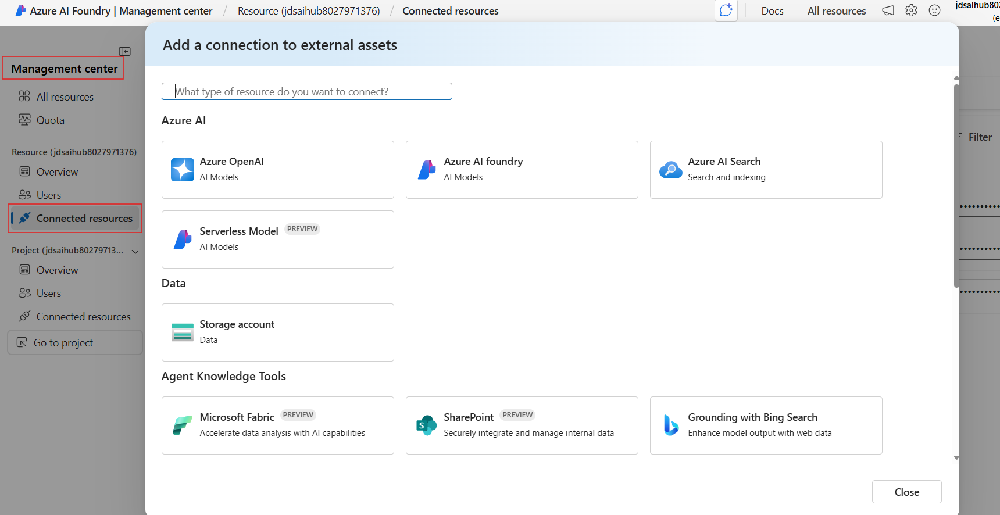
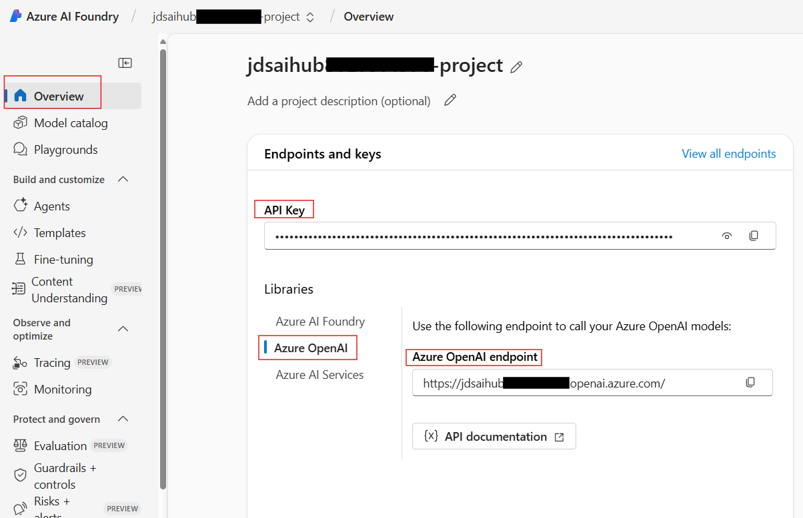

# 🚀 Microsoft Foundry & Agents Workshop

[](https://ai.azure.com)
[](https://python.org)
[](https://jupyter.org)

**End-to-End Microsoft Foundry And Agents Development Laboratory**

*Master Microsoft Foundry and Agents through hands-on experimentation and real-world applications*


## 🎯 Mission Statement

This comprehensive laboratory transforms you from an AI enthusiast into a Microsoft Foundry expert. Through progressive, hands-on modules, you'll master:

1. **Prompt Engineering (Portal)**
   - Chat with AI pattern in prompt messages (call center, image description extraction)
   - Hands-on exercises based on GitHub instructions

2. **AI Search**
   - Creating an index via Azure Portal
   - Chat over data in Playground connected to portal-created index
   - SDK approach: Creating an index using notebooks and Python code
   - Uploading data and creating indexes programmatically
   - Chat over data in Playground connected to SDK-created index

3. **Foundry SDK for LLM Communication**
   - Direct interaction with Large Language Models using SDK

4. **Agent Framework with DevUI**
   - Interactive chatting with agents using SDK and DevUI features

5. **Creating Agents in Portal**
   - Portal-based agent creation and configuration

6. **Foundry Agents with Capabilities**
   - Code Interpreter integration
   - Knowledge - Agent access to AI Search indexes created in previous labs

7. **Microsoft Foundry SDK - Advanced Agent Capabilities**
   - Leveraging agents with multiple capabilities

8. **Workflow in Agent Framework**
   - Sequential streaming workflow examples

9. **LangGraph with Workflow**
   - Advanced workflow orchestration using LangGraph

10. **Technical Deep Dive (Demo & Hands-on)**
    - FastAPI implementation
    - Streamlit integration (library installation and setup)
    - Model Context Protocol (MCP) - Client and Server architecture


---

## 📁 Repository Structure

```
AI-Application-Lab/
├── .env.template                          # Environment variables template (copy to .env)
├── README.md                              # This file
├── requirements.txt                       # Python dependencies
│
├── Day 1/                                 # Day 1: Foundry Basics & Prompt Engineering
│   ├── Hands On Tasks/
│   │   ├── 1.PromptEngineering.md
│   │   ├── 2.CreatingAISearchInPortal.md
│   │   └── 3.PlaygroundToAccessIndex.md
│   ├── Slides/
│   └── Use Cases/
│
├── Day 2/                                 # Day 2: Agents with Capabilities
│   ├── Hands On Tasks/
│   │   ├── 1.CreateAIAgent.md
│   │   ├── 2.AddCodeInterpreter.md
│   │   └── 3.AgentToAccessIndex.md
│   ├── Slides/
│   └── Use Cases/
│
├── Day 3/                                 # Day 3: SDK & Advanced Agent Development
│   ├── Hands on Tasks/
│   │   ├── 1.AISearch/                    # AI Search with SDK
│   │   │   ├── README.md
│   │   │   ├── data/
│   │   │   ├── search_queries.ipynb
│   │   │   ├── setup_search_index.ipynb
│   │   │   └── upload_to_blob.ipynb
│   │   ├── 2.ConnectToAIProgramatically/  # SDK Connection Methods
│   │   │   ├── ConnectToProjectClient.md
│   │   │   ├── ConnectToProjectClient.py
│   │   │   ├── ConnectViaAPIKey.md
│   │   │   ├── ConnectViaAPIKey.py
│   │   │   ├── ConnectViaBearerToken.md
│   │   │   └── ConnectViaBearerToken.py
│   │   ├── 3.InteractWithAIAgents/        # Agent Interaction Tasks
│   │   │   ├── overview.md
│   │   │   ├── azure_client.py
│   │   │   ├── task_1_create_client.py
│   │   │   ├── task_1.md
│   │   │   ├── task_2_create_agent.py
│   │   │   ├── task_2.md
│   │   │   ├── task_3_agent_communication.py
│   │   │   └── task_3.md
│   │   ├── 4.AzureOpenAIChatClient_devui.py  # Agent Framework DevUI
│   │   ├── 5.Sequential_streaming.py         # Workflow Streaming
│   │   └── 6.CreateLanggraphWorkflow/        # LangGraph Workflows
│   │       ├── README.md
│   │       ├── overview.md
│   │       ├── task_1_workflow.py
│   │       ├── task_1.md
│   │       ├── task_2_workflow.py
│   │       └── task_2.md
│   ├── Slides/
│   └── Use Cases/
│
├── Day 4/                                 # Day 4: Technical Deep Dive
│   ├── Hands On Tasks/
│   │   ├── 1.BuildFastAPIServer/          # FastAPI Implementation
│   │   │   ├── overview.md
│   │   │   ├── start_server.py
│   │   │   ├── task_1_server.py
│   │   │   ├── task_1.md
│   │   │   ├── task_2_server.py
│   │   │   ├── task_2.md
│   │   │   ├── task_3_server.py
│   │   │   ├── task_3.md
│   │   │   ├── task_4_server.py
│   │   │   ├── task_4.md
│   │   │   ├── task_5_server.py
│   │   │   ├── task_5.md
│   │   │   ├── test_cors.html
│   │   │   ├── test_task_1.py
│   │   │   ├── test_task_2.py
│   │   │   ├── test_task_3.py
│   │   │   ├── test_task_4.py
│   │   │   └── test_task_5.py
│   │   ├── 2.BuildStreamlitServer/        # Streamlit Integration
│   │   │   ├── overview.md
│   │   │   ├── task_1_app.py
│   │   │   ├── task_1.md
│   │   │   ├── task_2_app.py
│   │   │   ├── task_2.md
│   │   │   ├── task_3_app.py
│   │   │   ├── task_3.md
│   │   │   ├── task_4_app.py
│   │   │   ├── task_4.md
│   │   │   ├── test_task_1.py
│   │   │   ├── test_task_2.py
│   │   │   └── test_task_4.py
│   │   └── 3.BuildAgentsWithMCP/          # Model Context Protocol
│   │       ├── README.md
│   │       ├── client.py                  # MCP Client with Azure AI
│   │       └── server.py                  # MCP Server with tools
│   ├── Slides/
│   └── Use Cases/
│       └── Placeholder
│
└── images/                                # Documentation images
```

---
## 🚀 Getting Started

### Step 1: Repository Setup

```powershell
# Clone the laboratory repository
git clone <repository-url>
cd Pfizer-AI-labs

# Verify Python version (if not using DevContainer)
python --version  # Python 3.10+ required
```

### Step 2: Choose Your Development Environment

You have two options for setting up your development environment:

#### Local Python Environment (Standard venv)

If you prefer a local setup or don't have Docker:

```powershell
# Create and activate virtual environment
python -m venv .venv
.\.venv\Scripts\activate

# Install all dependencies with locked versions for reproducibility
pip install -r requirements.txt
```

> **💡 Note:** This project uses pip for dependency management to ensure consistent installations across all environments.
>
> To update dependencies, edit `requirements.txt` directly and run `pip install -r requirements.txt`.


### Step 3: Microsoft Foundry Setup

1. **Create Microsoft Foundry Resource and Project**
   
   To create a Microsoft Foundry resource in the Azure portal follow these instructions:

   - Select this Microsoft Foundry resource link: https://portal.azure.com/#create/Microsoft.CognitiveServicesAIFoundry

   - On the Create page, provide the following information:

   

   | Project details | Description |
   |----------------|-------------|
   | **Subscription** | Select one of your available Azure subscriptions. |
   | **Resource group** | The Azure resource group that will contain your Azure AI Foundry resource. You can create a new group or add it to a preexisting group. |
   | **Region** | The location of your Azure AI service instance. Different locations may introduce latency, but have no impact on the runtime availability of your resource. |
   | **Name** | A descriptive name for your Microsoft Foundry resource. For example, MyAIServicesResource. |
   | **Default Project Name** | Keep the default project as it is. |

   - Keep other settings for your resource as default, read and accept the conditions (as applicable), and then select **Review + create**.

2. **Assign Azure AI User Role**
   
   **Important:** Developers and lab attendees must be assigned the **Azure AI User** role to interact with the Microsoft Foundry project:
   
   - **Recommended:** Assign at the **Project level**
   - **Alternative:** If encountering permission issues, assign at the **Foundry Resource level**
   
   This role provides the necessary permissions to deploy models, create agents, and execute AI operations.
   
   For detailed guidance, follow the [Role-based access control for Microsoft Foundry](https://learn.microsoft.com/en-us/azure/ai-foundry/concepts/rbac-azure-ai-foundry?view=foundry-classic) documentation.
   
3. **Deploy Required Models & Services**
   
   | Model Type | Recommended Models | Purpose |
   |------------|-------------------|---------|
   | **Chat/Completion** | `gpt-4o`, `gpt-4o-mini` | Primary reasoning & conversation |
   | **Text Embeddings** | `text-embedding-3-large` | Vector search & RAG |

   - On the left Nav Menu of the foundry portal go to Models+endpoints
   - Click Deploy a model button-->Deploy base model
      - Search for the models in the table above , select a model, click confirm and Deploy and connect
       

4. **Configure an Azure Search Service**
   - Create an Azure AI Search resource in Azure
   - Connect this resource to your Microsoft Foundry project
      - Navigate to your Microsoft Foundry project → Management Center → Connected Resources → Add Connection → Select Azure AI Search
      
  
5. **Configure Environment Variables**
   - Copy `.env.template` to `.env` in the root directory and update values accordingly
   - This repository expects the `.env` file to be in the root directory, if you want to store it elsewhere or name it something else, update the `load_dotenv()` calls in notebooks
   - Many of the Environment Variables needed can be found in the Overview tab of your Microsoft Foundry project or the connected resources in the Management Center tab
   - For example, AZURE_OPENAI variables-
  

---
---

## 🛠️ Troubleshooting & Support

### ⚡ Common Issues & Solutions

**Kernel Issues in VS Code:**
```powershell
# Refresh kernel registration
python -m ipykernel install --user --name=ai-foundry-lab --display-name="AI Foundry Lab"
# Reload VS Code: Ctrl+Shift+P → "Developer: Reload Window"
```

**Environment Activation Problems:**
```powershell
# Set PowerShell execution policy
Set-ExecutionPolicy -ExecutionPolicy RemoteSigned -Scope CurrentUser

# Verify virtual environment
python -c "import sys; print(sys.executable)"
```

**Azure Authentication Issues:**
```powershell
# Recommended: Use Azure CLI authentication
az login --tenant YOUR_TENANT_ID
az account show

# Alternative: Clear cached credentials and re-login
az account clear
az login --tenant YOUR_TENANT_ID
az account show
```

> **Note:** If you see deprecation warnings about the Azure Account extension in VS Code, use `az login` in the terminal instead. The Azure Account extension for VS Code has been deprecated in favor of Azure CLI authentication.

### 📚 Additional Resources

- 📖 [Microsoft Foundry Documentation](https://learn.microsoft.com/en-us/azure/ai-foundry/)
- 🎥 [Video Tutorials](https://learn.microsoft.com/en-us/shows/ai-show/)
- 💡 [Best Practices Guide](https://learn.microsoft.com/en-us/azure/ai-services/responsible-use-of-ai-overview)

